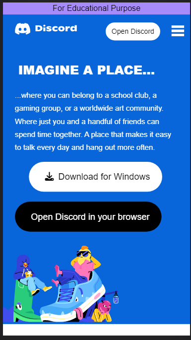
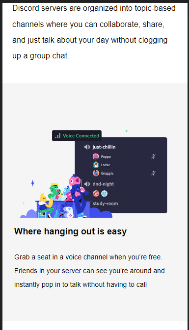
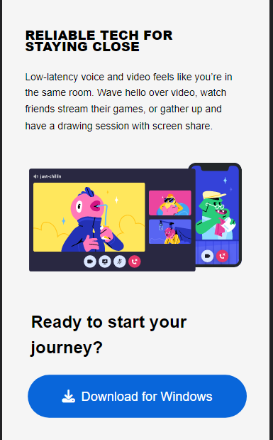
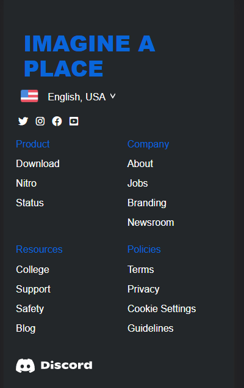
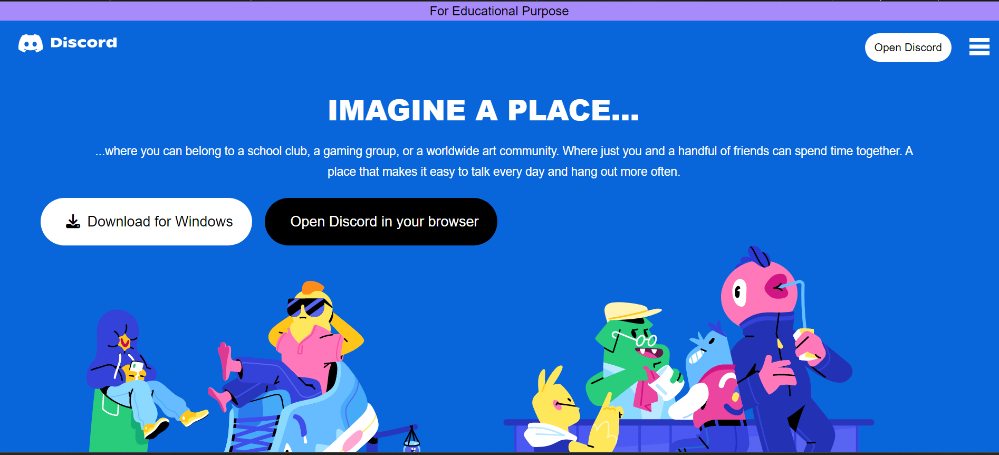
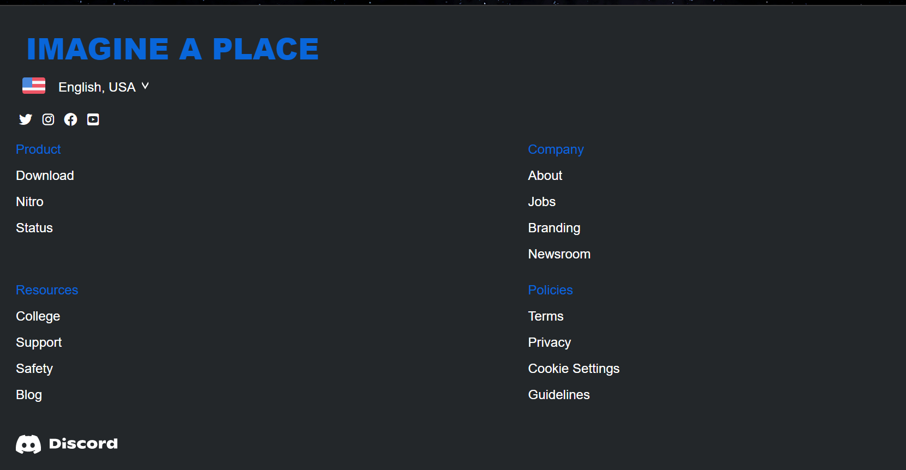

This is a simple clone of the official site of Discord

I have used basic languages like-  HTML & Tailwind CSS.

It consists  of all the sections of the home page of the site

 The design is responsive, adapting to different screen sizes using media queries.

### Checkout the live website [here]

## How the website looks like

